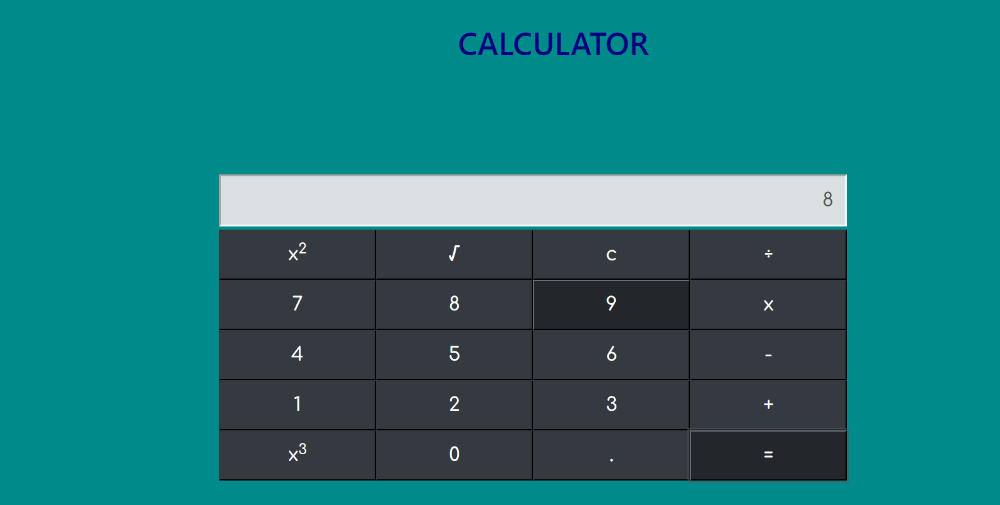

## Problem Description:
  - Create a calculator using DOM.
  - Use Keyboard events only for numbers.
  - When any keys pressed other than number keys show an alert warning "Only numbers are allowed" .
  - Add functions to perform addition ,subtraction,division,multiplication and modules.
  - The calculator must handle infix expressions.
  - Use DOM to create html elements.
  - for styles you can use css and bootstrap.
  - UI should be responsive for all media screens.

## How do I complete my design
- Create a file with an extension of `.html`.

- Use my own CSS properties and bootstrap properties to design my calculator

- All my code should be in `script.js` file where it has to be included inside of my html body element.

## To run this project

> cd calculator

>open link:http://127.0.0.1:3001/index.html

## Output Screenshot:

  

 